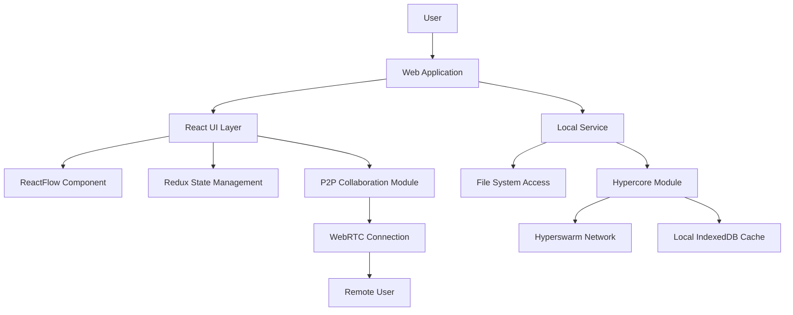
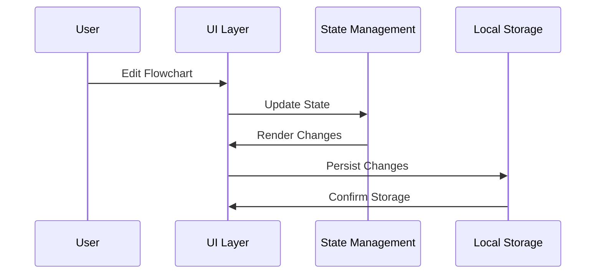
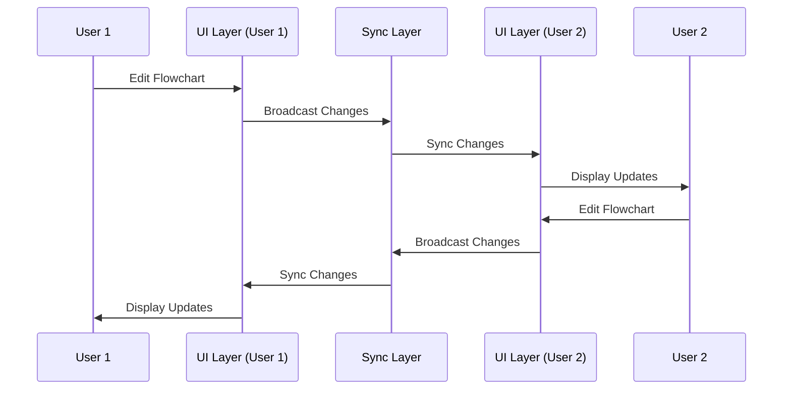

# Architecture - Hapa Flowchart

## Overview

Hapa Flowchart is designed as a web application that leverages the power of modern web technologies while maintaining compatibility with the broader Hapa ecosystem. This architecture document outlines the key components, data flows, and design decisions that form the foundation of the application.

## Architecture Diagram



## Key Components

### 1. Web Application Layer

The web application is built with React and Vite, providing a fast and responsive user interface. Key aspects include:

- **Progressive Web App (PWA)** capabilities for offline use and improved performance
- **Responsive Design** for use across different devices and screen sizes
- **Web-based Storage** using IndexedDB and localStorage for persistence

### 2. React UI Layer

The user interface is built with React 18+ and consists of:

- **React Flow Integration**: Core flowchart editing and visualization
- **Custom UI Components**: Built with Tailwind CSS and Headless UI
- **Responsive Layout**: Adapts to different screen sizes and orientations

### 3. State Management

State management is handled through:

- **Redux Toolkit**: For global application state
- **React Query**: For API data fetching and caching
- **Zustand**: For localized component state where appropriate
- **Yjs**: For collaborative state synchronization

### 4. Local Service Layer

The local service layer handles:

- **File System Access**: Reading and writing flowchart files locally using the File System Access API
- **Hypercore Integration**: Managing the connection to the Hypercore Protocol
- **Data Persistence**: Storing flowcharts and application settings

### 5. P2P Collaboration

Peer-to-peer collaboration is enabled through:

- **Yjs**: CRDT-based collaborative editing
- **WebRTC**: Direct peer connections for real-time collaboration
- **Hyperswarm**: P2P discovery mechanism when used with Hypercore backend

## Data Flow

### Local Editing Flow



### Collaborative Editing Flow



## Data Model

### Flowchart Structure

Flowcharts are stored as JSON objects with the following structure:

```typescript
interface Flowchart {
  id: string;
  name: string;
  description?: string;
  created: number;
  modified: number;
  nodes: Node[];
  edges: Edge[];
  viewport: {
    x: number;
    y: number;
    zoom: number;
  };
  metadata: {
    [key: string]: any;
  };
}
```

Nodes and edges follow the React Flow specification with added custom properties.

### Storage

Data is stored in multiple layers:

1. **In-Memory**: Redux state for active editing
2. **IndexedDB**: Persistent local storage for flowcharts
3. **File System**: Export/import capability via File System Access API
4. **Hypercore (Optional)**: For P2P synchronized storage and sharing

## Security Considerations

The application addresses security through:

- **Local-First Approach**: Data primarily stored on user's device
- **End-to-End Encryption**: For collaborative features
- **Capability-Based Security**: For sharing and permissions
- **Content Security Policy**: To prevent XSS and other injection attacks

## Progressive Enhancement

The application follows a progressive enhancement approach:

1. **Core Functionality**: Works with basic web capabilities
2. **Enhanced Features**: Activated when additional APIs are available (File System, etc.)
3. **Offline Support**: Through Service Workers and local storage
4. **P2P Collaboration**: Available when WebRTC is supported

## Integration Points

### Hapa Ecosystem Integration

- **Hapa Identity**: Integration with Hapa's decentralized identity system
- **Hapa Storage**: Compatibility with Hapa's storage solutions
- **Inter-App Communication**: API for other Hapa applications to use flowcharts

### External System Integration

- **Export Formats**: SVG, PNG, and JSON for interoperability
- **Import Capabilities**: Support for common flowchart formats
- **Web Share API**: For sharing flowcharts via the OS sharing interface 