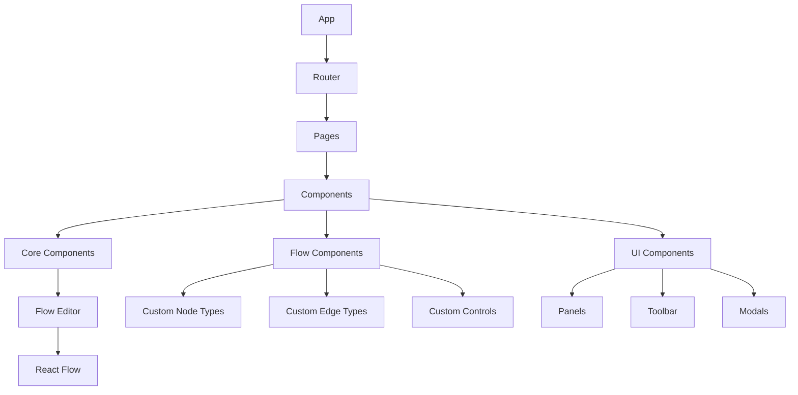

# Frontend Documentation

## UI Framework & Technology Stack

Hapa Flowchart uses a modern web-based technology stack:

- **Core Framework**: React 18+ with TypeScript for type safety
- **Build System**: Vite for fast development and optimized production builds
- **State Management**: Redux Toolkit for global state management
- **Styling**: Tailwind CSS with custom theme for consistent UI
- **UI Components**: Headless UI for accessible, unstyled components
- **Flowchart**: React Flow for node-based editors

## Architecture

The frontend follows a component-based architecture with clear separation of concerns:



## Key Components

### Layout Components

- **AppLayout**: Main application layout with sidebar, header, and content area
- **FlowEditor**: Container for React Flow with toolbar and property panel
- **Sidebar**: Navigation and project management
- **PropertyPanel**: Dynamic panel for editing selected node/edge properties

### Flowchart Components

- **FlowCanvas**: Wrapper around React Flow with added functionality
- **CustomNodes**: Various node types (process, decision, data, etc.)
- **CustomEdges**: Edge types with different styles and behaviors
- **CustomControls**: Zoom, fit view, and custom flowchart controls

### UI Components

- **Button**: Styled buttons with variants (primary, secondary, ghost)
- **Input**: Text inputs with validation
- **Select**: Dropdown selection components
- **Modal**: Dialog components for various interactions
- **Tooltip**: Contextual information display
- **Menu**: Dropdown and context menus

## State Management

State is managed through a combination of technologies:

- **Redux Toolkit**: For global application state
  - Flowchart data
  - Application settings
  - UI state (sidebar open/closed, active panels)
  
- **React Query**: For any API interactions
  - Data fetching and caching
  - Optimistic updates
  
- **Local State**: Component-level state using useState/useReducer
  - Form state
  - Temporary UI state

### State Structure

```typescript
interface RootState {
  flowcharts: {
    items: Record<string, Flowchart>;
    activeId: string | null;
    loading: boolean;
    error: string | null;
  };
  ui: {
    theme: 'light' | 'dark' | 'system';
    sidebarOpen: boolean;
    propertyPanelOpen: boolean;
    activePanel: string | null;
  };
  settings: {
    autosave: boolean;
    autoLayout: boolean;
    snapToGrid: boolean;
    gridSize: number;
  };
}
```

## Styling

The application uses Tailwind CSS with:

- **Custom Theme**: Extends Tailwind with Hapa brand colors
- **Dark Mode Support**: Uses Tailwind's dark mode with user preference detection
- **Component Classes**: Consistent class patterns for components
- **Responsive Design**: Mobile-first approach with responsive breakpoints

### Theme Configuration

```javascript
// tailwind.config.js
module.exports = {
  theme: {
    extend: {
      colors: {
        primary: {
          50: '#f0f9ff',
          100: '#e0f2fe',
          // ...other shades
          900: '#0c4a6e',
        },
        // ...other color definitions
      },
      // ...other theme extensions
    },
  },
  plugins: [
    require('@tailwindcss/forms'),
  ],
};
```

## Progressive Web App Features

Hapa Flowchart implements PWA capabilities:

- **Service Worker**: Using Workbox for caching and offline support
- **Web App Manifest**: For add-to-home-screen functionality
- **Offline Support**: Core application works without internet connection
- **File System Access**: Using the File System Access API for local file operations

## Development Guidelines

### Component Structure

Components should follow this structure:

```typescript
// MyComponent.tsx
import React from 'react';
import { useSelector, useDispatch } from 'react-redux';

// Types
interface MyComponentProps {
  title: string;
  onAction?: () => void;
}

// Component
export const MyComponent: React.FC<MyComponentProps> = ({ 
  title, 
  onAction 
}) => {
  // State and hooks
  const dispatch = useDispatch();
  const someData = useSelector(state => state.someData);
  
  // Handlers
  const handleClick = () => {
    if (onAction) onAction();
  };
  
  // Render
  return (
    <div className="p-4 bg-white rounded-lg shadow">
      <h2 className="text-xl font-bold">{title}</h2>
      <button 
        onClick={handleClick}
        className="px-4 py-2 mt-2 text-white bg-primary-600 rounded hover:bg-primary-700"
      >
        Take Action
      </button>
    </div>
  );
};
```

### File Structure

```
src/
├── assets/            # Static assets
├── components/        # Reusable components
│   ├── core/          # Core application components
│   ├── flow/          # Flow-specific components
│   │   ├── nodes/     # Custom node types
│   │   ├── edges/     # Custom edge types
│   │   └── controls/  # Custom controls
│   └── ui/            # Generic UI components
├── hooks/             # Custom React hooks
├── pages/             # Page components
├── services/          # Service abstractions
├── store/             # Redux store configuration
│   ├── slices/        # Redux Toolkit slices
│   └── selectors/     # Memoized selectors
├── styles/            # Global styles
├── types/             # TypeScript type definitions
└── utils/             # Utility functions
```

## Performance Considerations

- **Code Splitting**: Dynamic imports for route-based code splitting
- **Memoization**: Use of React.memo, useMemo, and useCallback
- **Virtual Rendering**: For large flowcharts, only render visible nodes
- **Web Workers**: For heavy computations like auto-layout

## Accessibility

- **Keyboard Navigation**: Full keyboard support for all interactions
- **Screen Reader Support**: ARIA attributes and semantic HTML
- **Focus Management**: Clear focus indicators and logical tab order
- **Color Contrast**: WCAG AA compliant color contrasts

## Testing Strategy

- **Unit Tests**: For individual components and utilities using Vitest
- **Integration Tests**: For feature flows using React Testing Library
- **E2E Tests**: For critical user journeys using Playwright
- **Visual Regression**: Using Storybook and Chromatic

## Build & Deployment

The application uses Vite for build optimization:

- **Code Splitting**: Automatic chunk splitting
- **Asset Optimization**: Image and asset optimization
- **CSS Minification**: PostCSS processing and minification
- **PWA Generation**: Automatic service worker generation

## Browser Support

The application targets modern browsers with good ES2020 support:

- Chrome/Edge (last 2 versions)
- Firefox (last 2 versions)
- Safari (last 2 versions)

Legacy browser support is provided through targeted polyfills where necessary. 