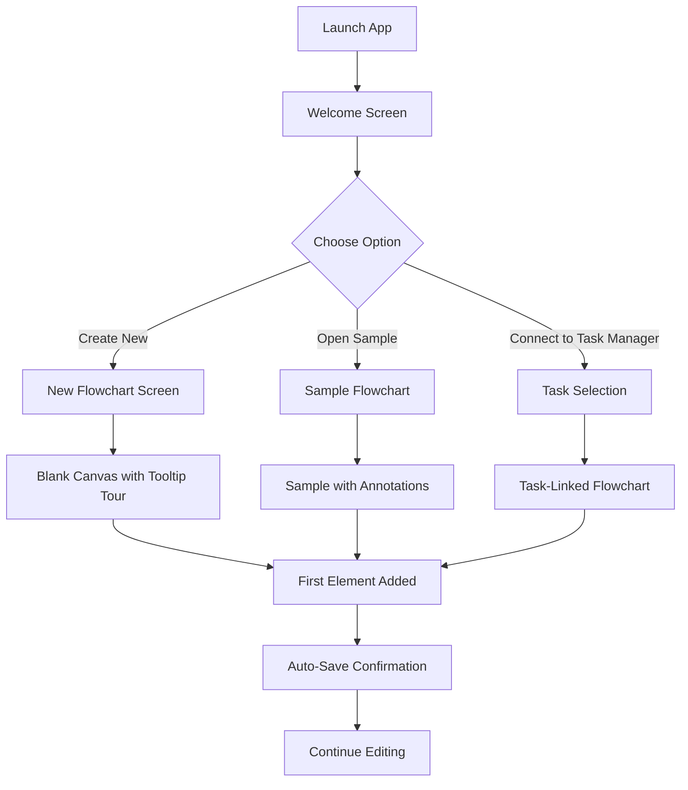
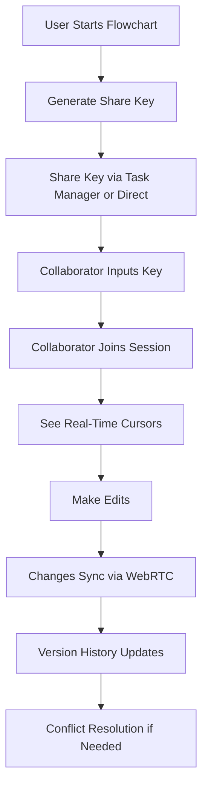
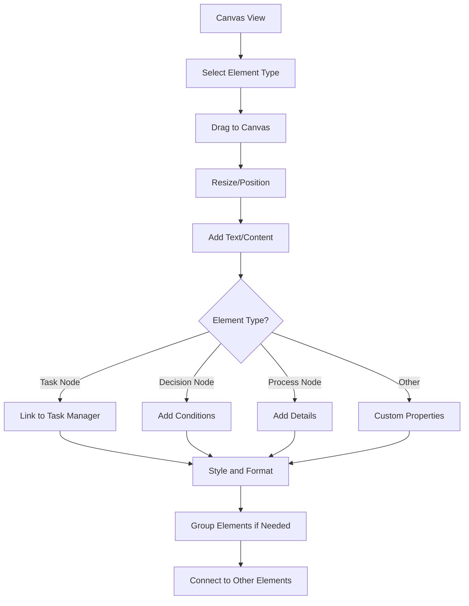

# User Flow - Hapa Flowchart

## Overview

This document describes the primary user flows within the Hapa Flowchart application, detailing the step-by-step processes users follow to accomplish key tasks. These flows are designed to be intuitive, minimize the learning curve, and leverage the decentralized nature of the Hapa ecosystem.

## Core User Journeys

### 1. First-Time Experience

**Goal:** Introduce new users to the application and help them create their first flowchart.



**Detailed Steps:**

1. **Launch App**
   - User opens the Hapa Flowchart app for the first time
   - No login required as it's a standalone app to begin with

2. **Welcome Screen**
   - App displays welcome screen with key features and options
   - Options include: Create New, Open Sample, Connect to Task Manager

3. **Choose Path**
   - **Create New**: Start with a blank canvas
   - **Open Sample**: Open a pre-built flowchart example
   - **Connect to Task Manager**: Browse tasks from Hapa Task Manager

4. **Initial Canvas**
   - Canvas loads with appropriate starting point
   - Interface highlights key tools and features with tooltips
   - Quick tutorial appears with skip option

5. **First Interaction**
   - User adds their first element (guided if needed)
   - Instant feedback shows success
   - Tooltip suggests connecting elements

6. **Auto-Save**
   - System automatically saves the flowchart locally
   - Confirmation message informs user of this feature
   - Local data storage using Hypercore is explained

### 2. Creating a New Flowchart

**Goal:** Enable users to create a flowchart from scratch efficiently.

```mermaid
flowchart TD
    A[Dashboard] --> B[Click "New Flowchart"]
    B --> C[Enter Name & Description]
    C --> D[Select Template/Blank]
    D --> E[Canvas with Element Palette]
    E --> F[Drag & Drop Elements]
    F --> G[Connect Elements]
    G --> H[Add Labels & Details]
    H --> I[Style Elements]
    I --> J[Auto-Layout Option]
    J --> K[Preview & Export]
    K --> L[Save Flowchart]
    L --> M[Share Options]
```

**Detailed Steps:**

1. **Start New Flowchart**
   - From dashboard, click "New Flowchart" button
   - Modal appears for initial setup

2. **Basic Information**
   - Enter name and optional description
   - Select starting point (blank canvas or template)
   - Choose template category if applicable

3. **Canvas Interaction**
   - Drag elements from the sidebar palette onto the canvas
   - Position elements by dragging them around
   - Resize elements using handles

4. **Create Connections**
   - Click on source node connection point and drag to target node
   - Connection line appears with formatting options
   - Add labels to connections as needed

5. **Add Details**
   - Double-click elements to add/edit text
   - Access element properties panel for advanced settings
   - Add descriptions, notes, or other metadata

6. **Style and Organize**
   - Apply colors, borders, and other visual styling
   - Use the auto-layout feature for clean organization
   - Group related elements if needed

7. **Save and Share**
   - Flowchart auto-saves continuously
   - Click "Share" to generate Hypercore key
   - Copy link to share or connect to Task Manager

### 3. Connecting to Hapa Task Manager

**Goal:** Enable users to link flowcharts with tasks from Hapa Task Manager.

```mermaid
flowchart TD
    A[Flowchart App] --> B[Click "Connect to Task Manager"]
    B --> C[Task Manager API Connection Dialog]
    C --> D[Browse Available Tasks]
    D --> E[Select Task to Link]
    E --> F{Task Has Existing Flowchart?}
    F -- Yes --> G[Open Existing Flowchart]
    F -- No --> H[Create New Linked Flowchart]
    G --> I[View Task Members as Collaborators]
    H --> I
    I --> J[Edit with Task Context]
    J --> K[Changes Sync to All Task Members]
```

**Detailed Steps:**

1. **Initiate Connection**
   - Click "Connect to Task Manager" in the sidebar or menu
   - Connection dialog appears with API configuration

2. **Browse Tasks**
   - Once connected, view list of tasks user has access to
   - Filter by project, status, or assigned members
   - Sort by deadline, priority, or other criteria

3. **Select Task**
   - Click on a task to view details
   - See if task already has linked flowchart(s)

4. **Link or Create**
   - If flowchart exists: Open existing flowchart
   - If no flowchart: Create new one linked to task
   - Confirm link operation

5. **Collaborative Context**
   - System shows other task members as potential collaborators
   - Task metadata appears in flowchart properties
   - Task status and details available in sidebar

6. **Synchronized Editing**
   - Changes to flowchart sync with all task members
   - Task members can join via P2P connection
   - Updates are distributed through the Hapa network

### 4. Real-Time Collaboration

**Goal:** Allow multiple users to work on the same flowchart simultaneously.



**Detailed Steps:**

1. **Initiate Sharing**
   - Create flowchart or open existing one
   - Click "Share" button in the toolbar
   - System generates a unique Hypercore key

2. **Distribute Access**
   - Option 1: Share directly via key (copy/paste)
   - Option 2: Share via Task Manager (if linked)
   - Option 3: Specify DIDs for direct permission

3. **Join Session**
   - Collaborator opens Flowchart app
   - Inputs share key or opens via Task Manager
   - Establishes P2P connection via WebRTC

4. **Collaborative Features**
   - See real-time cursor positions of other users
   - View who is currently editing which elements
   - Chat with collaborators via sidebar panel (optional)

5. **Synchronization**
   - Changes automatically sync to all connected users
   - WebRTC provides low-latency updates
   - Fallback to Hypercore replication when needed

6. **Version Control**
   - All edits tracked in version history
   - See who made which changes
   - Revert to previous versions if needed

7. **Handling Conflicts**
   - Concurrent edits resolved via CRDTs
   - Visual indication of conflicts when they occur
   - Simple resolution interface for user decision

### 5. Working with Flowchart Elements

**Goal:** Efficiently create, arrange, and customize flowchart elements.



**Detailed Steps:**

1. **Select Element Type**
   - Browse element palette in the sidebar
   - Available types: Process, Decision, Task, Start/End, etc.
   - Hover for preview and description

2. **Add to Canvas**
   - Drag element type onto canvas, or
   - Click element type then click on canvas
   - Element appears at cursor position

3. **Basic Manipulation**
   - Resize by dragging handles
   - Move by dragging entire element
   - Rotate using rotation handle (if applicable)

4. **Add Content**
   - Double-click to edit text directly
   - Use formatting toolbar for text styling
   - Add icons or images via properties panel

5. **Type-Specific Properties**
   - **Task Node**: Link to Hapa Task Manager task
   - **Decision Node**: Add condition text for each path
   - **Process Node**: Add detailed description
   - **Custom Node**: Configure based on template

6. **Style Element**
   - Change colors, borders, shadows
   - Apply predefined styles or custom formatting
   - Adjust opacity, line style, etc.

7. **Create Connections**
   - Click and drag from connection points
   - Style connections (straight, curved, angled)
   - Add labels to connections
   - Set connection types (normal, conditional, bidirectional)

8. **Advanced Organization**
   - Group related elements
   - Create swimlanes or containers
   - Use alignment tools for clean layout
   - Apply auto-layout for quick organization

### 6. Linking Tasks to Flowchart Nodes

**Goal:** Connect flowchart elements to specific tasks in Hapa Task Manager.

```mermaid
flowchart TD
    A[Edit Flowchart] --> B[Select Node]
    B --> C[Open Properties Panel]
    C --> D[Click "Link to Task"]
    D --> E[Browse Task Manager Tasks]
    E --> F[Select Task]
    F --> G[Confirm Link]
    G --> H[Node Updates with Task Data]
    H --> I[Task Status Changes Reflected]
    I --> J[Bidirectional Updates]
```

**Detailed Steps:**

1. **Select Target Node**
   - Click on flowchart node to select it
   - Ensure it's the appropriate type for task linking

2. **Access Link Feature**
   - Open the properties panel for the selected node
   - Find the "Link to Task" section
   - Click "Browse Tasks" button

3. **Task Selection**
   - View list of tasks from Hapa Task Manager
   - Filter/search for specific task
   - Preview task details before linking

4. **Establish Link**
   - Select desired task from list
   - Click "Link" button
   - Confirm the operation

5. **Visual Feedback**
   - Node updates with task metadata
   - Visual indicator shows linked status
   - Task details appear in tooltip/preview

6. **Synchronization**
   - Task status changes reflect in node appearance
   - Updates from Task Manager flow to flowchart
   - Optional: flowchart changes can update task (bidirectional)

7. **Managing Links**
   - View all linked tasks in dedicated panel
   - Change or remove links as needed
   - Create new tasks from flowchart nodes

### 7. Using Version History

**Goal:** Track changes to flowcharts and restore previous versions when needed.

```mermaid
flowchart TD
    A[Edit Flowchart] --> B[Changes Auto-Saved]
    B --> C[Click "Version History"]
    C --> D[Browse Versions Timeline]
    D --> E[Select Version to View]
    E --> F[Preview Selected Version]
    F --> G{Action?}
    G -- Restore --> H[Restore Version]
    G -- Compare --> I[Side-by-Side Comparison]
    G -- Continue Browsing --> D
    H --> J[Confirm Restoration]
    I --> K[Return to Current Version]
    J --> L[Resume Editing]
    K --> L
```

**Detailed Steps:**

1. **Access Version History**
   - Click "Version History" button in toolbar
   - Panel opens showing timeline of changes
   - Each entry shows timestamp, author, and summary

2. **Browse Versions**
   - Scroll through version list
   - Filter by date range or author
   - View commit messages and change summaries

3. **Examine Version**
   - Click on version entry
   - Preview appears showing flowchart at that point
   - Changes highlighted for easy identification

4. **Compare Versions**
   - Select two versions for comparison
   - View side-by-side or overlay diff
   - See precisely what changed between versions

5. **Restore Previous Version**
   - Select desired version
   - Click "Restore" button
   - Confirm restoration action

6. **Continue Work**
   - Restored version becomes new current version
   - Restoration action itself appears in version history
   - Resume editing with restored content

### 8. AI Suggestions (Gatekeeper)

**Goal:** Leverage local AI to improve flowchart design and organization.

```mermaid
flowchart TD
    A[Edit Flowchart] --> B[Click "AI Suggestions"]
    B --> C[Local AI Processes Flowchart]
    C --> D[Suggestions Appear]
    D --> E{Suggestion Type}
    E -- Layout --> F[Preview Layout Change]
    E -- Content --> G[Review Text Suggestions]
    E -- Structure --> H[View Structure Recommendations]
    F --> I[Apply or Dismiss]
    G --> I
    H --> I
    I -- Apply --> J[Flowchart Updates]
    I -- Dismiss --> K[Continue Editing]
    J --> K
```

**Detailed Steps:**

1. **Request Suggestions**
   - Click "AI Suggestions" button in toolbar
   - Choose suggestion type (layout, content, structure)
   - Local Llama.cpp model processes current flowchart

2. **Review Suggestions**
   - AI generates 3-5 specific improvement suggestions
   - Each suggestion appears with preview and explanation
   - Suggestions categorized by type and impact

3. **Suggestion Types**
   - **Layout**: Better arrangement of nodes for clarity
   - **Content**: Improved text or labels
   - **Structure**: Better connections or flowchart organization
   - **Optimization**: Simplification of complex areas

4. **Apply Changes**
   - Review each suggestion individually
   - See previews of how changes would look
   - Apply all, some, or none of the suggestions

5. **Advanced AI Features**
   - Auto-generate subtasks from complex processes
   - Identify potential bottlenecks or issues
   - Suggest task breakdown for complex nodes
   - GPU Burst option for complex optimizations (using Rose credits)

### 9. Exporting and Sharing Flowcharts

**Goal:** Export flowcharts in various formats and share them with others.

```mermaid
flowchart TD
    A[Complete Flowchart] --> B[Click "Export/Share"]
    B --> C{Export Type}
    C -- File Export --> D[Select Format]
    C -- Share Link --> E[Generate Share Link]
    C -- Task Manager --> F[Link to Task]
    D --> G[Configure Export Options]
    E --> H[Set Permissions]
    F --> I[Select Task to Link]
    G --> J[Download File]
    H --> K[Copy/Share Link]
    I --> L[Confirm Task Link]
    J --> M[Use Exported File]
    K --> N[Recipients Join via Link]
    L --> O[Task Members See Flowchart]
```

**Detailed Steps:**

1. **Choose Export/Share**
   - Click "Export/Share" button in toolbar
   - Menu appears with options

2. **File Export**
   - Select export format (SVG, PNG, JSON, PDF)
   - Configure export options (size, quality, etc.)
   - Choose export destination
   - Download file to local system

3. **Share via Link**
   - Generate unique Hypercore key as share link
   - Set permissions (view-only, edit, etc.)
   - Add expiration if desired
   - Copy link to clipboard

4. **Share via Task Manager**
   - Link flowchart to existing task
   - All task members gain access automatically
   - Optionally send notification to members

5. **Recipients Access**
   - Recipients open link in Hapa Flowchart app
   - P2P connection established automatically
   - Permissions applied based on settings

6. **Manage Sharing**
   - View active shares in sharing panel
   - Revoke access if needed
   - Change permission levels
   - See access statistics

### 10. Testing P2P Connections (Direct Hypercore ID)

**Goal:** Allow testing of the P2P functionality using direct Hypercore IDs.

```mermaid
flowchart TD
    A[Development Mode] --> B[Enable Testing Features]
    B --> C[Click "Join by Hypercore ID"]
    C --> D[Enter Hypercore ID]
    D --> E[Specify Test User Info]
    E --> F[Join Flowchart Directly]
    F --> G[Testing Interface Appears]
    G --> H[Simulate Multi-User Interactions]
    H --> I[Monitor Network Traffic]
    I --> J[Test Sync Performance]
```

**Detailed Steps:**

1. **Enable Testing Mode**
   - Access settings menu
   - Enable "Developer Testing" option
   - Testing toolbar appears

2. **Direct Join**
   - Click "Join by ID" button
   - Enter Hypercore ID or Hyperswarm topic
   - Optionally provide test user information

3. **Connection Feedback**
   - System attempts direct P2P connection
   - Debug information shows connection status
   - Warning indicates this is for testing only

4. **Testing Features**
   - Simulate multiple users with test controls
   - Monitor network traffic and sync events
   - Test edge cases like connection drops
   - Gather performance metrics

5. **Exit Testing**
   - Close test session when finished
   - Option to save test results
   - Return to standard interface

## Screen-by-Screen Flow

### Dashboard Screen

**Purpose:** Provide an overview of available flowcharts and quick access to common actions.

**Elements:**
- List of recent flowcharts with preview thumbnails
- "New Flowchart" button prominently placed
- Task Manager connection status
- Quick access to templates
- Search bar for finding flowcharts
- Filter options (date, tags, etc.)

**Actions:**
- Click flowchart to open
- Click "+" to create new
- Click "Connect" to link to Task Manager
- Search or filter flowcharts
- View/manage sharing settings

### Canvas Screen

**Purpose:** Primary workspace for creating and editing flowcharts.

**Elements:**
- Main canvas area (pannable and zoomable)
- Left sidebar with element palette
- Right sidebar with properties panel
- Top toolbar with core actions
- Bottom status bar with metadata
- Minimap for navigation (optional)

**Actions:**
- Drag elements from palette to canvas
- Select, move, and resize elements
- Connect elements with lines
- Edit element properties
- Apply styles and formatting
- Collaborate with other users
- Access version history

### Task Integration Screen

**Purpose:** Browse and link to tasks from Hapa Task Manager.

**Elements:**
- List of available tasks with status indicators
- Task details panel
- Search and filter controls
- Link management interface
- Current flowchart preview

**Actions:**
- Browse tasks by project, status, etc.
- Search for specific tasks
- View task details (assignees, deadlines, etc.)
- Link tasks to flowchart nodes
- Create new tasks from flowchart elements
- View task dependencies and relationships

### Collaboration Panel

**Purpose:** Manage real-time collaboration with other users.

**Elements:**
- List of connected users with status
- Cursor positions of other users
- Chat interface (optional)
- Permission controls
- Share link generator

**Actions:**
- See who's currently editing
- Chat with collaborators
- Change user permissions
- Copy share link for distribution
- View network connection status
- Enable/disable specific collaboration features

### Version History Screen

**Purpose:** Browse through previous versions of the flowchart.

**Elements:**
- Timeline of versions with timestamps
- Author information for each version
- Change summary for each version
- Preview of selected version
- Comparison tools

**Actions:**
- Browse through version history
- Compare versions side by side
- Restore previous versions
- View specific changes between versions
- Filter history by date or author

### Export/Share Screen

**Purpose:** Configure export settings and sharing options.

**Elements:**
- Format selection (SVG, PNG, JSON, PDF)
- Export settings (dimensions, quality, etc.)
- Share link generator
- Permission controls
- Task linking interface

**Actions:**
- Select export format and options
- Download exported file
- Generate and copy share link
- Set access permissions
- Link to Task Manager tasks
- Manage existing shares

## Interaction Patterns

### Drag and Drop

- Drag elements from palette to canvas
- Drag to position elements
- Drag between connection points to create links
- Drag files onto canvas to import

### Selection and Multi-Select

- Click to select single element
- Shift-click to select multiple elements
- Drag selection box to select area
- Ctrl/Cmd + A to select all

### Context Menus

- Right-click elements for context actions
- Right-click canvas for canvas-specific actions
- Right-click connections for connection options

### Keyboard Shortcuts

- Delete/Backspace: Remove selected elements
- Ctrl/Cmd + Z: Undo
- Ctrl/Cmd + Y: Redo
- Ctrl/Cmd + S: Force manual save
- Ctrl/Cmd + C/X/V: Copy/Cut/Paste
- Ctrl/Cmd + G: Group selected elements
- Arrow keys: Move selected elements
- Space + drag: Pan canvas
- Ctrl/Cmd + +/-: Zoom in/out

### Touch and Mobile Interactions

- Pinch to zoom
- Two-finger drag to pan
- Long press for context menu
- Double-tap to edit text
- Two-finger rotate for rotation

## Error Handling

### Connection Issues

**Scenario:** P2P connection fails or disconnects.

**User Flow:**
1. User sees connection status indicator turn red
2. Toast notification appears with error message
3. Automatic retry begins with progress indicator
4. User can manually retry or switch to offline mode
5. When connection restores, sync resumes automatically

### Conflict Resolution

**Scenario:** Two users edit the same element simultaneously.

**User Flow:**
1. System detects conflicting changes
2. Conflict notification appears to affected users
3. Visual indicator highlights the conflicted element
4. Conflict resolution dialog shows both versions
5. User chooses which version to keep or merges changes
6. Resolution is applied and synced to all users

### Permission Denied

**Scenario:** User attempts action without proper permissions.

**User Flow:**
1. User tries to edit a restricted element
2. Permission denied notification appears
3. Explanation of required permission is shown
4. Options presented: request access or view only
5. If applicable, Consul voting interface appears

### Offline Usage

**Scenario:** User loses internet connection.

**User Flow:**
1. Connection status changes to "Offline"
2. Toast notification informs of offline mode
3. User can continue editing with local storage
4. Pending changes queue is visible in status bar
5. When connection restores, sync dialog appears
6. User can review changes before syncing

## Accessibility Considerations

- All interactive elements have appropriate ARIA labels
- Keyboard navigation for all operations
- High-contrast mode option
- Screen reader compatibility for flowchart elements
- Color blind-friendly default palette
- Text scaling without breaking layouts
- Focus indicators for keyboard navigation

## Mobile-Specific Flows

While the full experience is optimized for desktop, essential functions are available on mobile:

### Mobile Viewing

**Goal:** Review flowcharts on mobile devices.

**Steps:**
1. Open shared link on mobile device
2. View-optimized interface loads
3. Pinch to zoom and pan
4. Tap elements to see details
5. Access basic version history
6. Add comments if permissions allow

### Mobile Quick Edits

**Goal:** Make simple edits while on the go.

**Steps:**
1. Open flowchart in mobile interface
2. Tap "Edit" button for simplified editing mode
3. Tap elements to select
4. Use simplified property editor
5. Add/edit text and basic properties
6. Save changes which sync to all users 